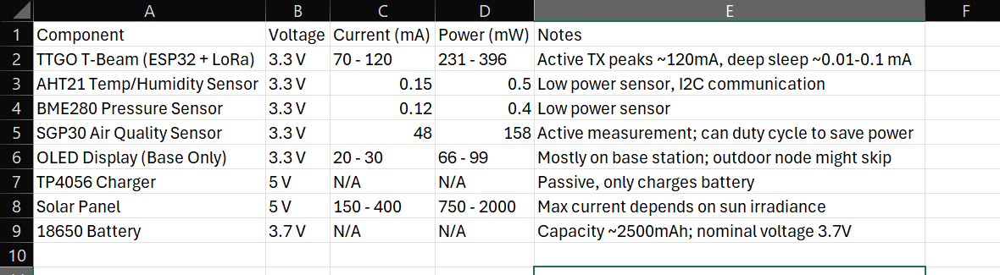
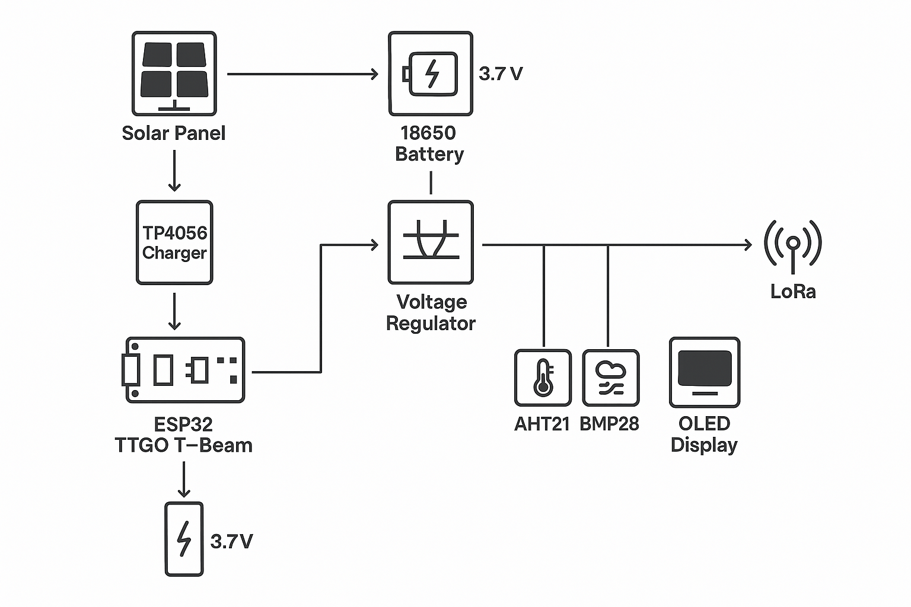
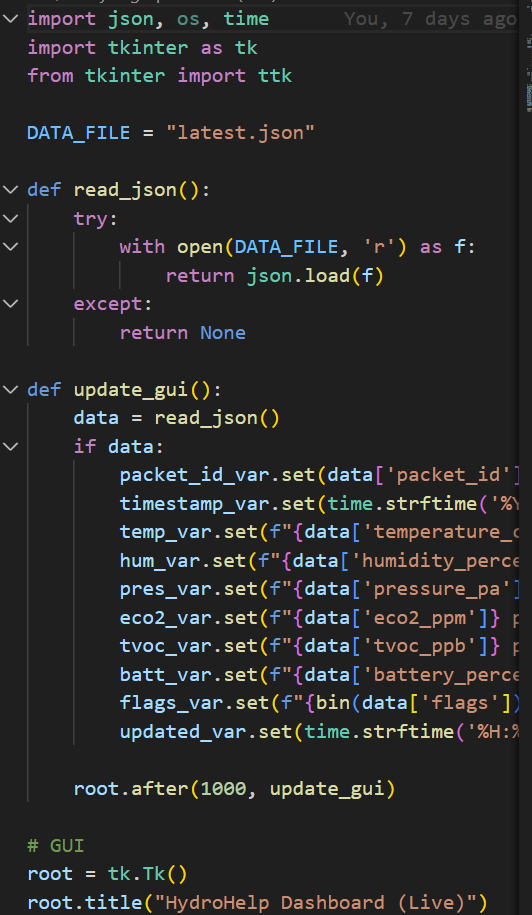
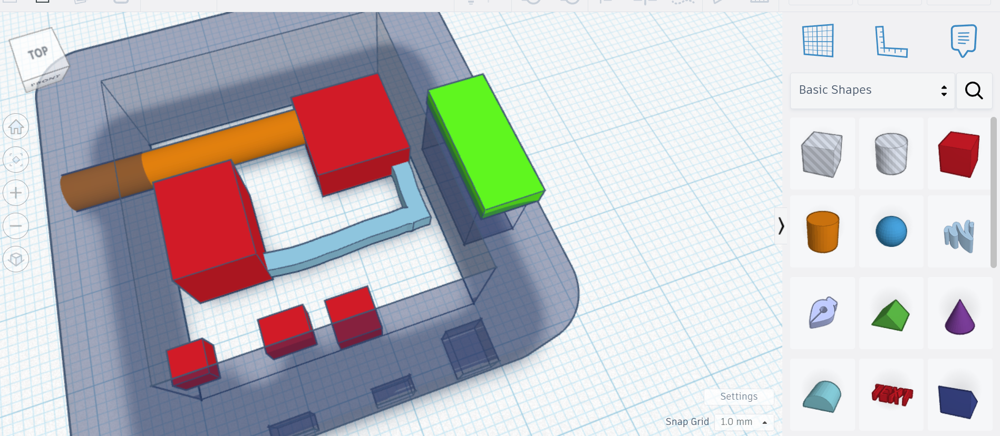
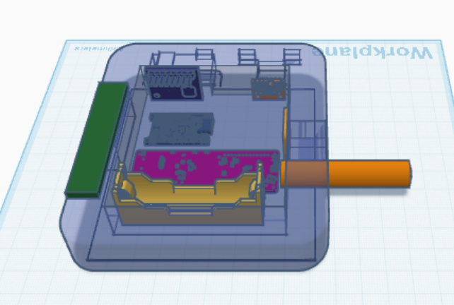

## 📓 **JOURNAL.md — Planning Phase Entries**

### #1 — June 22th: Project Brainstorming & Vision

**What I did:**

* Defined the core mission: create a **solar-powered, LoRa-based telemetry node** that sits on a roof and sends weather & air quality data back to an indoor receiver.
* Decided on the name **HydroHelp** cuz why not
* Outlined core features:
  * Sensors for temp, humidity, pressure, air quality
  * LoRa communication to a home base
  * Solar panel & battery
  * Waterproof enclosure (will CAD this)
  * Clock-based alerts to recommend watering grass cuz I keep forgetting to (if rain is low, humidity is dry)

**Next up:** Pick sensors and finalize LoRa boards

Images: N/A (this was the planning phase, tomorrow I should have some images)

**Total time spent:** 1.5h

---

### #2 — June 23th: Component Research & Feasibility

**What I did:**

* Compared LoRa boards: **TTGO T-Beam** wins for GPS, charging, and LoRa
* Chose sensors:
  * **AHT21** for temp/humidity
  * **BME280** for pressure (I saw these in Apex and they seem very cool) [link to datasheet](https://www.bosch-sensortec.com/media/boschsensortec/downloads/datasheets/bst-bme280-ds002.pdf)
  * **MQ135** for air quality (CO2/VOC-ish), might upgrade
* Looked into **18650 battery + TP4056 + solar** combo
* Explored IP-rated boxes and mounting options

**Next up:** Begin CAD shell design
![[basic-diagram-draw-lowqualityexport.png]]Notes on the basic overview: The parts aren't accurate as I used skimmed down stuff for this diagram. The Heltec V3 is the base station connected to OLED. 

**Total time spent:** 2h

---

### #3 — June 24th: Power Planning & Solar Strategy

**What I did:**

* Calculated estimated current draw of sensors + ESP32
* Designed basic power flow:
  `Solar Panel → TP4056 → 18650 → TTGO T-Beam`
* Identified power-saving needs (deep sleep modes)
* Researched small solar panels (\~5V, 1W+)

Note: I want a high quality voltage regulator, not like the buck converter we used for Apex, BUY A MORE EXPENSIVE ONE so system inits dont cause voltage drops.

**Total time spent:** 1.5h

---

### #4 — June 25th: LoRa Packet Design & Telemetry Structure

**What I did:**

* Considering JSON vs binary for transmission
* Defined packet interval (every 10–15 mins for temperature and humidity, every 5 mins for air quality)
* Home base will receive via LoRa and show stats on OLED, maybe push over serial to a Python logger, also maybe add a speaker for Air quality warnings (haptic alternative for less noise?)

Images: I have a lot of code, here's a screenshot of some specific code

**Total time spent:** 2h

----

### #5 - June 26th: CADDING
**What I did:**
* Created some basic CADs for the project
* Found in the /CADs/ directory under prototype 1

CAD explanation: Red base is the main chip with the orange cylinder being the radio antenna. There are sensor cutouts with sensors too and a solar mount with a hole beneath for wires. Other red box is battery system.

The last time I used CAD was in 7th grade and I barely used it at all, so I had to go through and learn how to use Tinkercad. While it's a rough first draft, it gives me a solid idea of what my project should look like.

I think a good idea of assembly is having the sensors mounted with brackets and allowing wires to run down back to the main grid. They should be enclosed in heat shrink tubing (I have a ton already). 

The top isn't shown in CAD drawings but I think for proto-2 CAD I may just cut out a space for the solar in the lid and allow wires to run down through crevices (which I can fill with silicone).

Because the device is supposed to remain outside on a roof where rain can also occur, the internals need to be sealed. I'll use silicone to close everything off and also apply a paste to all the components to prevent humidity from building (something similar to the paste we used in Apex). 

**Total time spent:** 1.5h

---
### #6 - July 2nd: Refining the CAD

Hydrohelp was rejected a couple days ago due to the CAD being a prototype and not complete (it was also rejected because images apparently aren't in the journal. Well, they definitely are.)

So, I created a CAD which you can see down below

Most of the components have been found from online CADs (grabcad.com was my savior) and then converted to the STL format because I use Tinkercad (imagetostl.com). 

The only things that I couldn't grab direct CADs for were the antenna, solar capture thingy (loosing brain cells) and all the wires that'll hold this together.

All the sensors will be held with silicoln and some plastic mounting brackets. I may be pivoting to a 3D printed case but I will measure (with my calliper) the exact dimensions of all the components before ordering the case. I hate reordering. I hate it hate it hate it hate it....

So yeah, there's a complete CAD of the entire project, accurate to the 0.1mm! 

**Total time spent**: 3h