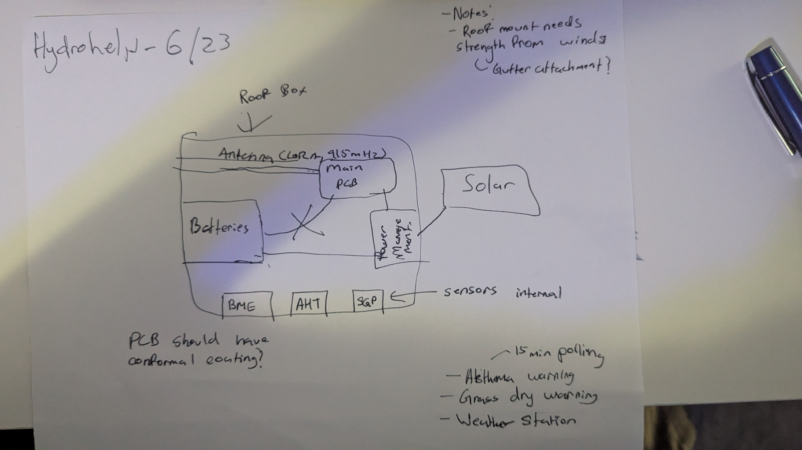
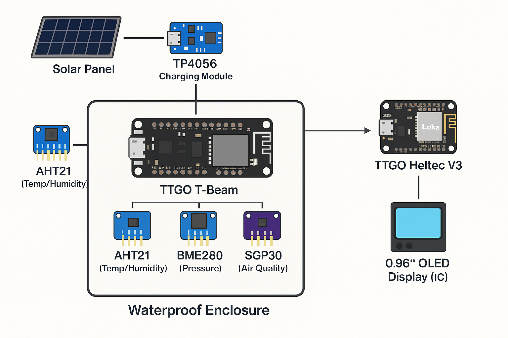

# Journal Planning Logs

### D1 - 06/22/2025: Brainstorming

Progress:
* Defined what the project will do
	* HH will sit on a roof pinging a home station at an interval telling me if there is an increased risk of asthma or if I should water the grass that day
* Decided on the name for the project, HydroHelp
* Core features:
	* Sensors for temp, humidity, pressure, and air quality (gathered from different sensors)
	* LoRA communication to homebase
	* Solar panel and battery for a "no touch" operation once installed on the roof
	* Waterproof enclosure using silicon to further gate
	* Clock-based alerts to recommend watering grass cuz I keep forgetting to (if rain is low, humidity is dry)

**Tomorrow**: Pick the parts

Images: A sketch (recovered)

**Time**: 1.5h

---
### D2 - 6/23/2025

Progress: 
* Compared LoRA boards,  **TTGO T-Beam** wins for GPS, charging, and LoRa
	* It's pretty much an all-in-one solution
* Chose sensors:
	* **AHT21** for temp/humidity
	  * **BME280** for temp, humidity, pressure (I saw these in Apex and they seem very cool) [link to datasheet](https://www.bosch-sensortec.com/media/boschsensortec/downloads/datasheets/bst-bme280-ds002.pdf)
		  * Having two boards report temp/humidity is nice for getting more accurate results instead of getting data from a single sensor
	  * **MQ135** for air quality (CO2/VOC-ish)
	  * Looked into **18650 battery + TP4056 + solar** combo
	  *  Explored IP-rated boxes and mounting options, 3D printing one also works

Images (all diagrams via Canva):

**Tomorrow**: Power planning, CAD if I have time
**Time**: 2h

---
### D3 - 6/24/2025 - Power planning
Progress:
* Calculated power draws of sensors + ESP32
* Designed a basic power flow:   `Solar Panel → TP4056 → 18650 → TTGO T-Beam`
* Highlighted some power-saving needs like deep sleep and modulated pinging for data
* Researched small solar panels  (~5V, 1W+)
* 
Images: 

Note: I want a high quality voltage regulator, not like the buck converter we used for Apex, BUY A MORE EXPENSIVE ONE so system inits dont cause voltage drops.

**Tomorrow**: CAD, Code
**Time**: 1.5h

---
### D4 - 6/25/2025 - LoRA Packet Design & Basic Code Structuring

Progress:
* Considered JSON vs Binary for transmission, going with JSON for now as tested in Apex
* Defined packet interval (every hour for humidity/temperature, every 15 mins for air quality)
* Home base will receive via LoRa and show stats on OLED, maybe push over serial to a Python logger, also maybe add a speaker for Air quality warnings (haptic alternative for less noise?)

Images: I have a lot of code, here's a screenshot of some specific code

**Tomorrow**: CADDing
**Total time spent:** 2h

---
### D5 - 6/26/2025 - CADDing 
Progress:
* Created some basic CADs for the project

* Found in the /CADs/ directory under prototype 1

CAD explanation: Red base is the main chip with the orange cylinder being the radio antenna. There are sensor cutouts with sensors too and a solar mount with a hole beneath for wires. Other red box is battery system.

The last time I used CAD was in 7th grade and I barely used it at all, so I had to go through and learn how to use Tinkercad. While it's a rough first draft, it gives me a solid idea of what my project should look like.

I think a good idea of assembly is having the sensors mounted with brackets and allowing wires to run down back to the main grid. They should be enclosed in heat shrink tubing (I have a ton already).

The top isn't shown in CAD drawings but I think for proto-2 CAD I may just cut out a space for the solar in the lid and allow wires to run down through crevices (which I can fill with silicone).

Because the device is supposed to remain outside on a roof where rain can also occur, the internals need to be sealed. I'll use silicone to close everything off and also apply a paste to all the components to prevent humidity from building (something similar to the paste we used in Apex).

Submitted this day.
**Time**: 1.5h

---

### D6 - 7/02/2025 - CAD Updates, Refining

Hydrohelp was rejected a couple days ago due to the CAD being a prototype and not complete (it was also rejected because images apparently aren't in the journal. Well, they definitely are.)

So, I created a CAD which you can see down below

Most of the components have been found from online CADs (grabcad.com was my savior) and then converted to the STL format because I use Tinkercad (imagetostl.com).

The only things that I couldn't grab direct CADs for were the antenna, solar capture thingy (loosing brain cells) and all the wires that'll hold this together.

All the sensors will be held with silicoln and some plastic mounting brackets. I may be pivoting to a 3D printed case but I will measure (with my calliper) the exact dimensions of all the components before ordering the case. I hate reordering. I hate it hate it hate it hate it....

So yeah, there's a complete CAD of the entire project, accurate to the 0.1mm!

**Total time spent**: 3h